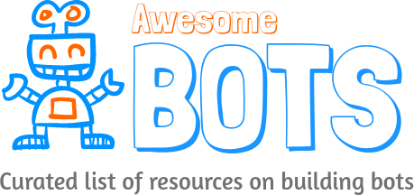

  

 
 
   

Table of Contents
-----------------
- [Platform Documentation](#platform-documentation)
- [Hybrid Channel Open-source Frameworks](#hybrid-channel-open-source-frameworks)
- [non-Open-source Tools For Building Bots](#non-open-source-tools-for-building-bots)
- [Tools for sentiment analysis](#tools-for-sentiment-analysis)
- [Bots building consulting companies](#bots-building-consulting-companies)
- [Tools For Bot Analytics](#tools-for-bot-analytics)
- [Tools For Bot Conversation Mockups](#tools-for-bot-conversation-mockups)
- [Nodejs Libraries](#nodejs-libraries)
- [Charting Libraries](#charting-libraries)
- [Facebook Messenger Libraries](#facebook-messenger-libraries)
- [Slack Libraries](#slack-libraries)
- [Telegram Libraries](#telegram-libraries)
- [Bot Stores](#bot-stores)
- [Tutorials](#tutorials)
- [Communities](#communities)
- [Conferences](#conferences)
- [Funding and News](#funding-and-news)
- [License](#license)

## Platform Documentation
* [Facebook messenger](https://developers.facebook.com/products/messenger/)
* [Slack](https://api.slack.com/bot-users)
* [Discord](https://blog.discordapp.com/the-robot-revolution-has-unofficially-begun/)
* [Telegram](https://core.telegram.org/bots/api)
* [Kik](https://dev.kik.com/#/home)
* [Zulip](https://zulip.com/integrations/)
* [HipChat](https://developer.atlassian.com/hipchat/getting-started)
* [Skype](https://developer.microsoft.com/en-us/skype/bots)
* [Cisco Spark](https://developer.ciscospark.com/getting-started.html)
* [WeChat](https://admin.wechat.com/)
* [VKontakte](https://new.vk.com/dev/bizmessages)

## Hybrid Channel Open-source Frameworks
* [Microsoft Bot Framework](https://dev.botframework.com/)
* [Universal Bot Framework](https://bitbucket.org/phips28/universal-bot-framework/overview) - Create crossplatform chat bots for FB Messenger, Kik, Telegram and Skype with just one logic.
* [BotKit](https://github.com/howdyai/botkit) - Botkit is a toolkit for making bot applications.
* [Claudia Bot Builder](https://github.com/claudiajs/claudia-bot-builder) - Create chat bots for FB, Slack, Skype and Telegram and deploy to AWS Lambda in minutes.
* [abot](https://github.com/itsabot/abot) - a digital assistant framework that enables anyone to easily build a digital assistant similar to Apple's Siri, Microsoft's Cortana, Google Now, or Amazon Alexa
* [lita](https://github.com/litaio/lita) - Ruby starter bot
* [ChatterBot](https://github.com/gunthercox/ChatterBot) - ChatterBot is a machine-learning based conversational dialog engine build in Python which makes it possible to generate responses based on collections of known conversations. 

## non-Open-source Tools For Building Bots
* [wit.ai ](https://wit.ai/) - Easily create text or voice based bots that humans can chat with.
* [Botkit](https://howdy.ai/botkit/) - Botkit eases the process of designing and running bots that live inside Slack.
* [api.ai](https://api.ai/) - Build brand-unique, natural language interactions for devices, applications and services.
* [luis.ai](https://www.luis.ai) - Microsot NPM service to pair with their botframework.
* [lex](https://aws.amazon.com/lex) - AWS for Building Conversational Voice & Text Bots
* [Text It](https://textit.in/) - Visually build SMS and voice apps to engage your customers.
* [Chatfuel](https://chatfuel.com/) - The intuitive bot builder with AI navigation. No coding required.
* [Watson](http://www.ibm.com/cloud-computing/bluemix/watson/) - Bring the power of cognitive computing to your apps.
* [Beep Boop](https://beepboophq.com/) - Beep Boop is a simple hosting platform for your Slack and Messenger bots.
* [Dexter](https://rundexter.com/app/spreadsheet-bot) - Get a Slack bot that responds with answers from your own Google Sheet.
* [Converse.ai](http://www.converse.ai/) - Respond to customer questions instantly with intelligent chatbot technology.
* [Haven OnDemand](https://dev.havenondemand.com/apis) - They are similar APIs as that of watson, but far well documented   and have a freemium version.
* [Recast.ai](https://recast.ai) - Collaborative Bot Platform for developers: build conversational bots easily.
* [mypolly.ai](http://www.mypolly.ai) - Real human like conversation api
* [meesho](http://www.meesho.com) - Whatsapp bot
* [manychat](https://manychat.com/) - Quick way to create facebook bot for non-programmers
* [botsify](https://botsify.com/) - Quick way to create facebook bot for non-programmers
* [chatbotkit](https://www.chatbotkit.com/) - chat bot for publishers and bloggers
* [kore](https://kore.com/) - Custom bot for e-commerce
* [automat.ai](http://www.automat.ai) - AI focuseed chatbot building
* [chatsuite](https://www.chatsuite.com) - AI focussed chat company
* [Pandorabots](http://www.pandorabots.com/) - web service for building and deploying chatbots.
* [Gupshup](https://www.gupshup.io/developer/home) - Easiest & fastest way to build & deploy your bots on any channel.
* [flowxo](https://flowxo.com/) - Readymade flows for multiple industried coupled with integration with a bot
* [compose.ai](http://www.compose.ai/) -  Quick multichannel bot for non programmers
* [meya.ai](https://meya.ai/) - Multichannel bot full framework
* [onsequel](https://www.onsequel.com/) -  Quick multichannel bot for non programmers
* [motion.ai](https://www.motion.ai/) - Visually build multichannel bot for non programmers 
* [init.ai](https://www.init.ai) -  End to end build train and deploy chatapps
* [msg.ai](https://www.msg.ai) - Commerse focused bots
* [viv](viv.ai) - Viv is an artificial intelligence platform that enables developers to create an intelligent, conversational interface to anything
* [reinfer.io](https://reinfer.io/) - Customer support focussed bot
* [smooch.io](https://smooch.io/) - Customer support focussed bot
* [pullstring](https://www.pullstring.com) - NLP engine
* [www.mindmeld.com](www.mindmeld.com) - Deep-Domain Conversational AI to Power the Next Generation of Voice and Chat Assistants
* [conversable](conversable.com) - An enterprise conversation platform for creating intelligent, on-demand, automated response flows through one-to-one conversations
* [next it]www.nextit.com - An intelligent interface that is ready when you are. Our conversational A.I. is a layer of technology that sits between you, your team and your customers.

## Tools for sentiment analysis
* [IBM Bluemix](www.ibm.com/bluemix)
* [Monkeylearn](www.monkeylearn.com)

## Bots building consulting companies
* [jiffybots](https://jiffybots.com/)
* [azumo](https://blog.azumo.co/we-are-chatbot-developers-8314caab2fc8)

## Tools For Bot Analytics
* [ChatMetrics](https://chatmetrics.io/) - Engagement platform for bots. ChatMetrics allows to reactivate inactive users and improve retention by sending "smart" notifications to users.
* [Dialog](https://dialoganalytics.com/) - Chatbot analytics platform for marketers to drive user engagement, retention, conversion and understand behavior.
* [Dashbot](https://www.dashbot.io/) - Actionable Bot Analytics: Increase user engagement, acquisition, and monetization.
* [botan.io](http://botan.io/) - analytics for your Telegram bot
* [Botanalytics](https://botanalytics.co)
* [Bot-metrics](https://bot-metrics.com)

## Tools For Bot Conversation Mockups
* [Bot Society](https://www.botsociety.io) - Bot conversation Mockups for presentation and demo.
* [Bot Sketch](https://dribbble.com/shots/2674603-Facebook-Messenger-UI-Kit-for-Chatbots-Sketch) - Sketch Chatbot UI (Mac Only)
* [Bots Mockuuups](https://bots.mockuuups.com/)

## Nodejs Libraries
* [Qtypes](https://github.com/superscriptjs/qtypes) - Rule based Answer Type classification system in Node.js.

## Charting Libraries
* [Image Charts](https://image-charts.com/)
* [Charturl](https://charturl.com)

## Facebook Messenger Libraries
* [Go](https://github.com/paked/messenger)

## Slack Libraries
* [Node.js (Official)](https://github.com/slackhq/node-slack-sdk)
* [Python (Official)](https://github.com/slackhq/python-slackclient)

## Telegram Libraries
* [Node.js](https://github.com/yagop/node-telegram-bot-api)
* [Node.js](https://github.com/telegraf/telegraf)
* [PHP](https://github.com/irazasyed/telegram-bot-sdk)
* [Python](https://github.com/python-telegram-bot/python-telegram-bot)
* [C#](https://github.com/MrRoundRobin/telegram.bot)
* [Go](https://github.com/tucnak/telebot)

## Bot Stores
* [ChatBottle](https://chatbottle.co/) - Chatbots search engine
* [Botlist](https://botlist.co/) - An App Store For Bots.
* [Botpages](www.botpages.com) - All Channel bot directory
* [Slack Store](https://decentralizedweb.slack.com/apps) - The official Slack bot store.
* [Slack Bots Directory](https://chatbotsgroup.slack.com/apps/category/At0MQP5BEF-bots)-
* [Telegram Store](https://storebot.me/) - The official Telegram bot store.
* [Product Hunt](https://www.producthunt.com/topics/bots) - Product Hunt bot list.
* [Dashbot](http://www.dashbot.io/bots) - Dashbot bot directory.
* [Skype Bot Directory](https://bots.botframework.com/) - The official list of skype bots by Microsoft Bot Framework
* [Teamchat](http://www.teamchat.com/en/bot-store/) - Bot store by teamchat.

## Tutorials
* [The Complete Beginner’s Guide To Chatbots.](https://chatbotsmagazine.com/the-complete-beginner-s-guide-to-chatbots-8280b7b906ca).
* [The Secret To Making Your Own Facebook Messenger Bot In Less Than 15 Minutes.](https://chatbotsmagazine.com/have-15-minutes-create-your-own-facebook-messenger-bot-481a7db54892)
* [How to create a chatbot without coding a single line](https://chatbotsmagazine.com/how-to-create-a-chatbot-without-coding-a-single-line-e716840c7245#.kimh0igkz)
* [How To Build Bots for Messenger.](https://developers.facebook.com/blog/post/2016/04/12/bots-for-messenger/)
* [Creating A Chat Bot.](https://medium.freecodecamp.com/creating-a-chat-bot-42861e6a2acd#.32hmkqfq7)
* [A Beginner’s Guide To Your First Bot.](https://slackhq.com/a-beginner-s-guide-to-your-first-bot-97e5b0b7843d#.rreq2dp6r)
* [Pair Programming a Facebook Messenger Bot.](https://www.youtube.com/watch?v=zFO1cRr5-qY)
* [A beginner’s guide to your first bot](https://slackhq.com/a-beginner-s-guide-to-your-first-bot-97e5b0b7843d#.b1rilkua8) 
* [botwiki](https://botwiki.org/tutorials/)

## Communities
* [Bots](https://www.facebook.com/groups/chatbot/) - Facebook group.
* [UX for Bots](https://www.facebook.com/groups/uxforbots/) - Facebook group.
* [Chat Bot Magazine](https://chatbotsmagazine.com/) - Medium.
* [HH Bots](https://www.facebook.com/groups/hhbots/) - Facebook group.
* [Messenger Platform Developer Community](https://www.facebook.com/groups/242384196138564/) - Official Facebook group.

## Conferences
* [ChatbotConf] (https://chatbotconf.com/)
* [Talkabot] (https://talkabot.ai/)

## Funding and News
* [Botfunded](https://botfunded.com)
* [botweekly](botweekly.com)
* [Bots Timeline](https://www.cbinsights.com/blog/bot-startups-timeline/)
* [chatbots Magazine](https://chatbotsmagazine.com/chatbots-have-raised-over-170m-in-8-months-5df6aa6a0cf2#.ayt1xbg1a)
* [ventureradar-  25 chatbots](http://blog.ventureradar.com/2016/06/14/25-chatbot-startups-you-should-know)
* [AI startups in India](https://www.quora.com/What-are-the-best-AI-startups-in-India)

## License

To the extent possible under law, [Vishnu Ks](http://www.vishnuks.com) has waived all copyright and related or neighboring rights to this work.
